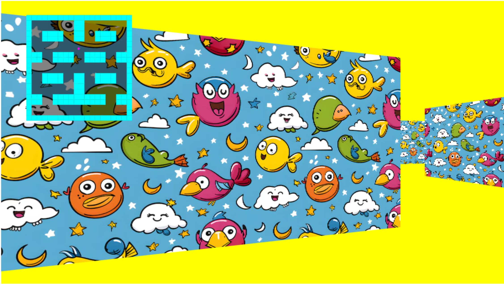

# Violet Ultra JS - Raycasting (Version 2)

> [!WARNING]
> This is a work In Progress! Anything can change at any moment without any notice! Use this at your own risk!

Version 2 - Old-School Raycasting Graphics using the work in progress Violet Ultra JS game engine.
Version 2 adds textures

Test in now on GitHub Pages: https://enrique-za.github.io/uyv-raycasting-v2/

Use the w, a, s and d key to move around the scene. 
